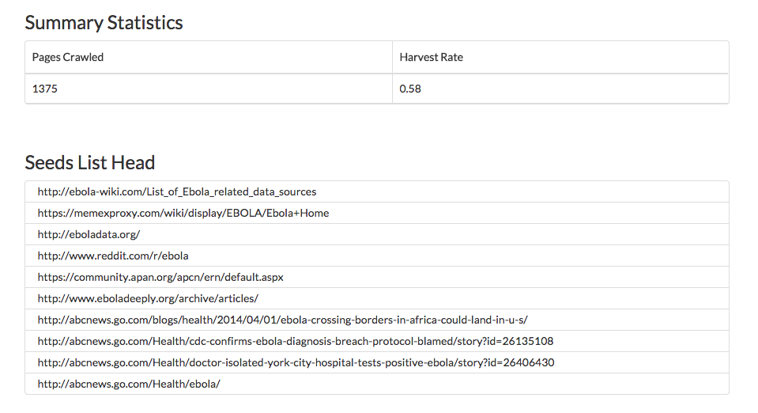

#############
Crawler Guide
#############
Memex Explorer uses two crawlers, Ache and Nutch.

****************
Crawler Overview
****************
Memex explorer uses two crawlers, `Nutch`_ and `Ache`_. Both crawlers have their own unique resigns, and both use the data they collect in unique ways.

There is some commonality between the two, however. They both require a list of URLs to crawl, called a seeds list, and they both share similar interactivity with the `Crawler Control Buttons`_. This section will go over the common elements of the two crawlers.

Creating a Seeds List
=====================
The common point between the two crawls is that they both use the same kind of seed list for their crawling. The seed list is comprised ot a list of urls separated by line breaks. Both Nutch and Ache use them in different ways, and the result you get directly from the crawlers is different for each of them. Here is a sample seed list:

.. code-block:: html

   http://www.reddit.com/r/aww
   http://gizmodo.com/of-course-japan-has-an-island-where-cats-outnumber-peop-1695365964
   http://en.wikipedia.org/wiki/Cat
   http://www.catchannel.com/
   http://mashable.com/category/cats/
   http://www.huffingtonpost.com/news/cats/
   http://www.lolcats.com/

Simply put, the seeds list should contain pages that are relevant to the topics you are searching. Both Nutch and Ache provide insight into the relevance of your seed list, but in different ways.

For the purposes of memex-explorer, the extenstion and name of your seeds list does not matter. It will be automatically renamed and stored according to the specifications of the crawler.

Crawler Control Buttons
=======================
Here's an overview of the buttons available to each crawler for controlling the crawlers. The buttons behaves differently depending on which crawler you are using.

.. image:: _static/img/crawler_control.png

Options Button
    Symbolized by the "gears" icon. This allows you to change various settings on the crawl. See `Crawl Settings`_.

Start Button
   Symbolized by the "play" button. This will start the crawler for you, and will display the status as "starting" immediately after pressing it, and "running" after the crawl has been started.

Stop Button
    Symbolized by the "stop" button. Stops the crawl.

    In the case of Ache, the crawler stops immediately. In the case of Nutch, the crawler stops after it has finished the current round. This is in order to prevent data corruption which can occur when killing the Nutch process.

Restart Button
    Symbolized by the "refresh" icon. Restarts the current crawl. This button is only available after the crawl has stopped.

    With Ache, it will immediately start a brand new Ache crawl, deleting all of the previous crawl information. With Nutch, it will start a new crawler round, using the previous information gathered by the crawl.

Get Seeds List
    This button will let you download the list of seeds that the crawler is currently using.

Get Crawl Log
    This button will let you download the log of the current running crawl. This allows you to see the progress of the crawl and any errors that may be occurring during the crawl.

Crawl Settings
==============
The crawl settings page allows you to delete the crawl, as well as change the name or description of the crawl. It is accessed by clicking the "gears" icon next to the name of the crawl:

.. image: _static/img/crawl_settings.png

*****
Nutch
*****
`Nutch <http://nutch.apache.org/>`_ is developed by Apache, and has

Nutch Dashboard
=======================
.. image:: _static/img/nutch_dashboard.png

Nutch Specific Buttons
======================

****
Ache
****
Ache is developed by...

Ache Dashboard
======================
.. image:: _static/img/ache_dashboard1.png

Statistics
    Like Nutch, ache also collects statistics for its crawls, and allows you to see the head of the seeds list.
    Harvest rate reflects the relevance to the model of the pages crawled. In this case, 58% of the pages crawled were relevant according to the model.

Building a Crawl Model
======================
This is how you build a crawl model.
