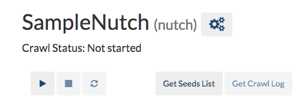
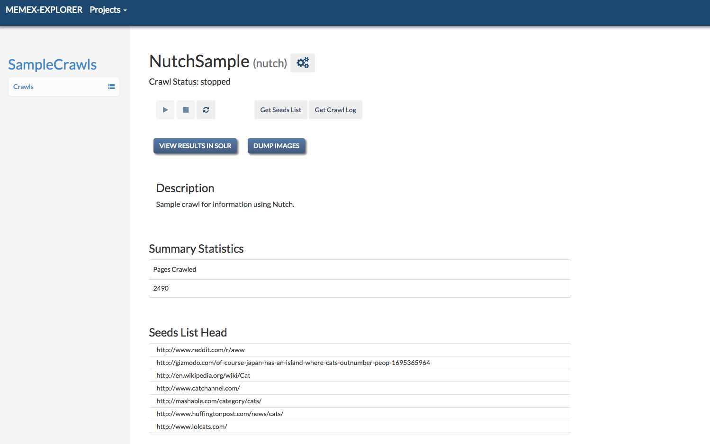
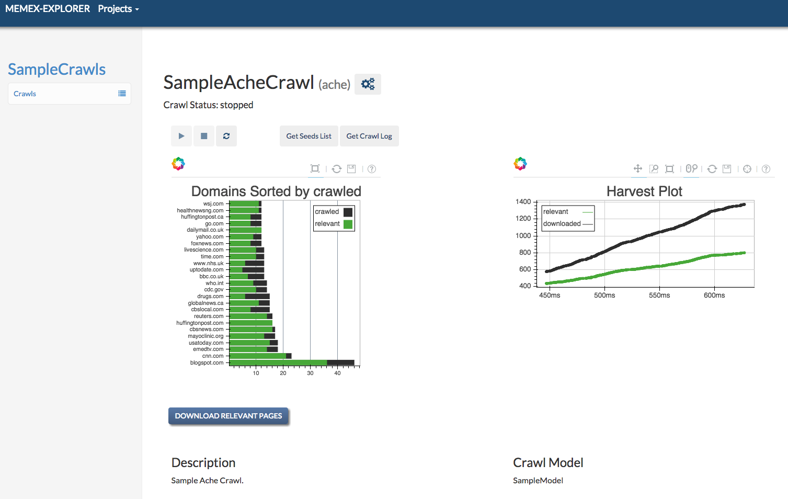
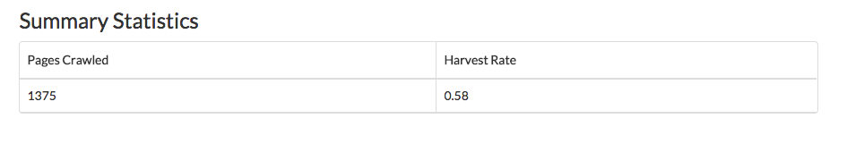

############################
Memex Explorer Crawler Guide
############################
memex-explorer uses two crawlers, :ref:`ache-section` and :ref:`nutch-section`.

****************
Crawler Overview
****************
    Both crawlers have their own unique designs, and both use the data they collect in unique ways.

    There is some commonality between the two, however. They both require a list of URLs to crawl, called a seeds list, and they both share similar interactivity with the `Crawler Control Buttons`_.

    This section will go over the common elements of the two crawlers.

Creating a Seeds List
=====================
    The common point between the two crawlers is that they both use the same kind of seeds list for their crawling. The seeds list is comprised of a list of urls separated by line breaks. Both Nutch and Ache use them in different ways, and the result you get directly from the crawlers is different for each of them. Here is a sample seeds list:

    .. code-block:: html

       http://www.reddit.com/r/aww
       http://gizmodo.com/of-course-japan-has-an-island-where-cats-outnumber-peop-1695365964
       http://en.wikipedia.org/wiki/Cat
       http://www.catchannel.com/
       http://mashable.com/category/cats/
       http://www.huffingtonpost.com/news/cats/
       http://www.lolcats.com/

    Simply put, the seeds list should contain pages that are relevant to the topics you are searching. Both Nutch and Ache provide insight into the relevance of your seeds list, but in different ways.

    For the purposes of memex-explorer, the extenstion and name of your seeds list does not matter. It will be automatically renamed and stored according to the specifications of the crawler.

Crawler Control Buttons
=======================
Here's an overview of the buttons available to each crawler for controlling the crawlers. The buttons behave differently depending on which crawler you are using.

Options Button
--------------
    Symbolized by the "gears" icon. This allows you to change various settings on the crawl. See `Crawl Settings`_.

Start Button
------------
   Symbolized by the "play" button. This will start the crawler for you, and will display the status as "starting" immediately after pressing it, and "running" after the crawl has been started.

Stop Button
-----------
    Symbolized by the "stop" button. Stops the crawl.

    In the case of Ache, the crawler stops immediately. In the case of Nutch, the crawler stops after it has finished the current round. This is in order to prevent data corruption that can occur when killing the Nutch process.

Restart Button
--------------
    Symbolized by the "refresh" icon. Restarts the current crawl. This button is only available after the crawl has stopped.

    With Ache, it will immediately start a brand new Ache crawl, deleting all of the previous crawl information. With Nutch, it will start a new crawler round, using the  information gathered by the crawl in the previous round.

Get Seeds List
--------------
    This button will let you download the list of seeds that the crawler is currently using.

Get Crawl Log
-------------
    This button will let you download the log of the current running crawl. This allows you to see the progress of the crawl and any errors that may be occurring during the crawl.

Crawl Settings
==============
    The crawl settings page allows you to delete the crawl, as well as change the name or description of the crawl. It is accessed by clicking the "gears" icon next to the name of the crawl.

    .. image:: _static/img/crawl_settings.png

    Here you can change the name or description of the crawl. You can also delete the crawl.

    .. _nutch-section:

*****
Nutch
*****
    `Nutch <http://nutch.apache.org/>`_ is developed by Apache, and has interfaces with both Solr and Elasticsearch, and it allows memex-explorer to offer different crawling functionality from Ache.

    Nutch runs in uninterruptible rounds of crawling. Nutch will run indefinitely until asked to stop. By viewing the crawl log, it is possible to see how many pages are left to crawl in the current round.

    The number of pages left to crawl in a Nutch round increases significantly after each round. With Nutch, you can pass it a seeds list of 100 pages to crawl, and it can find over 1000 pages to crawl for the next round. Because of this, Nutch is a much easier crawler to get running.

Nutch Dashboard
=======================

Statistics
----------
    memex-explorer will tell you how many pages have been crawled after the current round has finished.

Nutch Specific Buttons
----------------------
    Nutch has two buttons which are unique to its implementation.

    The first button is a link to a Solr instance, which you can use to search the results of the crawls using the standard Solr interface.

.. _ache-section:

****
Ache
****
    `Ache <https://github.com/ViDA-NYU/ache>`_ is developed by NYU. Ache is different from Nutch because it requires a crawl model to be created before you can run a crawl (see `Building a Crawl Model`_). Unlike Nutch, Ache can be stopped at any time. However, if you restart an Ache crawl, it will erase all the data from the previous crawl.

Ache Dashboard
======================

Plots
-----
    memex-explorer uses `Bokeh <http://bokeh.pydata.org/en/latest/>`_ for its plots. There are two plots available for analyzing Ache crawls, Domain Relevance and Harvest Rate.

    The Domain Relevance plot sorts domains by the number of pages crawled, and adds information for relevancy of that domain to your crawl model. This plot helps you understand how well your model fits.

    The Harvest Rate plot shows the overall performance of the crawl in terms how many pages were relevant out of the total pages crawled.

Statistics
----------
    Like Nutch, Ache also collects statistics for its crawls, and allows you to see the head of the seeds list.

    Harvest rate reflects the relevance to the model of the pages crawled. In this case, 58% of the pages crawled were relevant according to the model.

Ache Specific Buttons
---------------------
    Ache has a "Download Relevant Pages" button, which will allow you download which pages Ache has found to be relevant to your seeds list and your crawl model.

Building a Crawl Model
======================
    Ache requires a crawl model to run. For information on how to build crawl models, see the `Ache readme <https://github.com/ViDA-NYU/ache/blob/master/README.md>`_.

    For more detailed information on Ache, head to the `Ache Wiki <https://github.com/ViDA-NYU/ache/wiki>`_.
