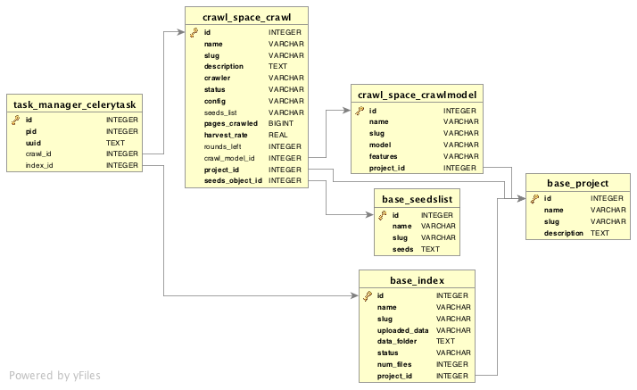

###################################
Developer's Guide to Memex Explorer
###################################

*************************
Setting up Memex Explorer
*************************

   To setup your machine, you will need Anaconda or Miniconda installed. Miniconda is a minimal Anaconda installation that bootstraps conda and Python on any operating system. Install `Anaconda <http://continuum.io/downloads>`_ or `Miniconda <http://conda.pydata.org/miniconda.html>`_ from their respective sites.

   Memex Explorer requires conda, either from Miniconda or Anaconda.

Application Setup
=================
    To set up a developer's environment, clone the repository, then
    run the app_setup.sh script:

    .. code-block:: html

       $ git clone https://github.com/memex-explorer/memex-explorer.git
       $ cd memex-explorer/source
       $ ./app_setup.sh

    You can then start the application from this directory:

    .. code-block:: html

       $ source activate memex
       $ supervisord

   Memex Explorer will now be running locally at `http://localhost:8000 <http://localhost:8000/>`_.

Tests
=====
    To run the tests, return to the root directory and run:

    .. code-block:: html

       $ py.test

The Database Model
==================
   The current entity relation diagram:

Updating the Database
---------------------
   As of version 0.4.0, Memex Explorer will start tracking all database migrations. This means that you will be able to upgrade your database and preserve the data without any issues.

   If you are using a version that is 0.3.0 or earlier, and you are unable to update your database without server errors, the best course if action is to delete the existing `file at source/db.sqlite3` and start over with a fresh database.

Enabling Non-Default Services
=============================

Nutch Visualizations
--------------------

   Nutch visualizations are not enabled by default. Nutch visualizations require RabbitMQ, and the method for installing RabbitMQ varies depending on the operating system. RabbitMQ can be installed via Homebrew on Mac, and apt-get on Debian systems. More information on how to install RabbitMQ, read `this page <https://www.rabbitmq.com/download.html>`_.  Note: You may also need to change the below command to `sudo rabbitmq-server`, depending on how RabbitMQ is installed on your system and the permissions of the current user.

   To enable Bokeh visualizations for Nutch, change ``autostart=false`` to ``autostart=true`` for both of these directives in `source/supervisord.conf`, and then kill and restart supervisor.

   .. code-block:: html

      [program:rabbitmq]
      command=rabbitmq-server
      priority=1
      -autostart=false
      +autostart=true

      [program:bokeh-server]
      command=bokeh-server --backend memory --port 5006
      priority=1
      -autostart=false
      +autostart=true

Domain Discovery Tool (DDT)
---------------------------

   Domain Discovery Tool can be installed as a conda package. Simply run `conda install ddt` to download the package for DDT.

   Like with Nutch visualizations, to enable DDT, change the directive in `source/supervisord`.

   .. code-block:: html

      [program:ddt]
      command=ddt
      priority=5
      -autostart=false
      +autostart=false

Temporal Anomaly Detection (TAD)
--------------------------------

   TAD does not currently have a conda package. Like the Nutch visualizations, it also has a RabbitMQ dependency. For instructions on installing TAD, visit the `github repository <https://github.com/autonlab/tad>`_.

   Like DDT and Nutch Visualizations, you also have to change the supervisor directive.

   .. code-block:: html

   [program:tad]
   command=tad
   priority=5
   -autostart=false
   +autostart=false
