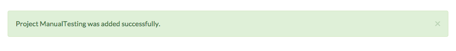
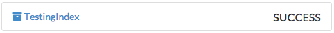

####################
Manual Testing Guide
####################
By following this guide, you will be able to test all the significant elements of the application. All of the files required for testing are in the repository under "source/test_resources".

****************
Testing Projects
****************

Project Creation
================
When you start up the application, you should see a landing page with a button for adding a new project.

1. Click the new project button.
2. Provide a name and a description for the project on the next page, and press submit.
3. Verify that you see a green banner at the top of the screen confirming that you have successfully created the project.

4. In the top right of the screen, verify that the projects dropdown is working, and that it list the name of project you just created.
5. On the right side of the screen, click the "list" icons to test that the dropdowns are working.
6. Verify that both dropdowns are empty, and that no indices or crawls have been created.

Project Settings
================
1. Click the "gears" icon next to the name of the project on the project overview page.

2. Supply a different name and description for the project, and hit "submit".
3. Verify that the project was edited successfully by checking the success message at the top of the page.

.. image:: _static/img/testing_guide/project_edit_success.png

4. Go back to the settings page.
5. Click on the "trashcan" icon. Verify that there is a popup asking you whether you want to delete the project.
6. Click no, and verify that you get a second popup which verifies that you cancelled.
7. Click on the trash icon and click yes.
8. Verify that you are taken to the landing page, and that there are no projects listed on the landing page.

***************
Testing Indices
***************

Index Creation
==============
1. Create a new project.
2. Click on the "Add Index" button either in the sidebar or under the list of indices on the project page.
3. Add an index. Give the index a name and a zip file. There are two zipfiles in the repository to use, located at "source/resources/test_resources". Click submit.
4. Verify that the index was added successfully by checking for the success message at the top of the page.
5. Verify that the index was successfully created by checking the status next to the name of the index.

6. In your browser, open a new tab or window and goto http://localhost:9200/. This is the location of the elasticsearch instance.
7. Navigate to your newly created index using the following URL structure: localhost:9200/<index_name>/_search?pretty.
8. Verify that the newly created index reflects the number of documents in your zipfile and the content of those documents.

Index Settings
==============
1. Click on the link to the index on the project overview page. This will take you to the index settings page.

.. image:: _static/img/testing_guide/edit_index_link.png

2. Supply a new zipfile for the index creation. Use the zipfile that you did not use earlier -- "sample2.zip" if you earlier used "sample.zip".
3. Verify that the index was updated successfully by checking the indices list. 
4. Verify that the new files were added to the newly created index.
5. Return to the index settings page and click the "trashcan" icon. As before, confirm that the cancel button works, and then delete the index. 
6. Confirm that the index was deleted successfully by looking at the list of indices on the project overview page.

**************
Testing Crawls
**************

Testing Nutch Crawls
====================
Potato.
