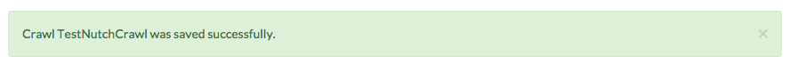

####################
Manual Testing Guide
####################
By following this guide, you will be able to test all the significant elements of the application. All of the files required for testing are in the repository under "source/test_resources".

****************
Testing Projects
****************

Project Creation
================
1. When you start up the application, you should see a landing page with a button for adding a new project.

    a. Click the new project button.
    b. Provide a name and a description for the project on the next page, and press submit.
    c. Verify that you see a green banner at the top of the screen confirming that you have successfully created the project.

    .. image:: _static/img/testing_guide/project_success_message.png

    d. In the top right of the screen, verify that the projects dropdown is working, and that it list the name of project you just created.
    e. On the right side of the screen, click the "list" icons to test that the dropdowns are working.
    f. Verify that both dropdowns are empty, and that no indices or crawls have been created.

Project Settings
================
1. Click the "gears" icon next to the name of the project on the project overview page.

    .. image:: _static/img/testing_guide/settings.png

    a. Supply a different name and description for the project, and hit "submit".
    b. Verify that the project was edited successfully by checking the success message at the top of the page.

    .. image:: _static/img/testing_guide/project_edit_success.png

1. Go back to the settings page.

    a. Click on the "trashcan" icon. Verify that there is a popup asking you whether you want to delete the project.
    b. Click no, and verify that you get a second popup which verifies that you cancelled.
    c. Click on the trash icon and click yes.
    d. Verify that you are taken to the landing page, and that there are no projects listed on the landing page.

***************
Testing Indices
***************

.. _index-creation:

Index Creation
==============
1. Create a new project.
2. Click on the "Add Index" button either in the sidebar or under the list of indices on the project page.

    a. Add an index. Give the index a name and a zip file. There are two zipfiles in the repository to use, located at "source/resources/test_resources". Click submit.
    b. Verify that the index was added successfully by checking for the success message at the top of the page.
    c. Verify that the index was successfully created by checking the status next to the name of the index.

    .. image:: _static/img/testing_guide/index_creation_success.png

6. In your browser, open a new tab or window and goto http://localhost:9200/. This is the location of the elasticsearch instance.

    a. Navigate to your newly created index using the following URL structure: localhost:9200/<index_name>/_search?pretty.
    b. Verify that the newly created index reflects the number of documents in your zipfile and the content of those documents.

Index Settings
==============
1. Click on the link to the index on the project overview page. This will take you to the index settings page.

    .. image:: _static/img/testing_guide/edit_index_link.png

    a. Supply a new zipfile for the index creation. Use the zipfile that you did not use earlier -- "sample2.zip" if you earlier used "sample.zip".
    b. Verify that the index was updated successfully by checking the indices list. 
    c. Verify that the new files were added to the newly created index.

2. Return to the index settings page and click the "trashcan" icon. As before, confirm that the cancel button works, and then delete the index. 

    a. Confirm that the index was deleted successfully by looking at the list of indices on the project overview page.

**************
Testing Crawls
**************

Testing Nutch Crawls
====================
Included with the repository is a test seeds file. You can use this file to testing of nutch and ache crawls. The seeds file is located at "source/test_resources/test_crawl_data/cats.seeds".

1. From the project overview page, click the Add Crawl button on the list of crawls or in the sidebar dropdown.
2. At the add crawl page, supply a name and description.

    a. Make sure that the "nutch" option is selected.

    .. image:: _static/img/testing_guide/crawler_nutch.png

    b. Add the seeds list from the test resources directory, and hit "Submit"

3. Verify that the crawl has been added successfully.

4. You should now be on the crawl page.

   a. Verify that the crawl status and available buttons are the same as in this image.

   .. image:: _static/img/testing_guide/nutch_dashboard_initial.png

   b. The following buttons should be available: "Start Crawl", "Get Seeds List". All other buttons should be greyed-out.
   c. The crawl status should be set to NOT STARTED with 0 rounds left to crawl.

5. Create another nutch crawl, but this time copy the contents of the cats.seeds file into the textbox. Submit the crawl.

   a. On the crawl page, click the "Get Seeds List" button.
   b. Verify that the contents of the downloaded file match the contents of cats.seeds.

6. Verify that the crawl completes successfully.

   a. When you start the crawl, there should be two rounds left.
   b. At the end of the first round, summary statistics should list total pages crawled as between 6 and 9.
   c. After the first round is done, the status should show "SUCCESS" before going onto the next round.
   d. On the start of the next round, the crawl status should change to "STARTED"
   e. At the end of the second round, the rounds left should be zero.
   f. The pages crawled should be between 300 and 400.
   g. The crawl control dashboard should resemble this:

   .. image:: _static/img/testing_guide/crawl_buttons_success.png

7. Verify the crawl index

   a. Refer to step 6 of :ref:`index-creation` on how to access the index from the browser.
   b. Type in the name of the crawl index to see the crawl data. Verify that there are between 200 and 300 "hits", or documents.

8. Verify that log.io is functioning

   a. Below the crawl dashboard you should see a window containing tabs for accessing log.io and kibana
   b. While a crawl is running, the output of the log.io tab should look like this:

   .. image:: _static/img/testing_guide/logio_running.png

9. Verify that kibana is functioning.

   a. Click on the Kibana tab.
   b. Enter the following information on the "Settings" page.

    .. image:: _static/img/testing_guide/add_index_kibana.png

   c. Head to the "Discover" page.
   d. Verify that you get the following output:

    .. image:: _static/img/testing_guide/kibana_data.png

Test Crawl Settings
====================
1. On the crawl page, click the "gears" icon to access the settings.

    a. Change the name and description of the crawl, and submit.
    b. Click the "trashcan" icon to delete the crawl.
    c. Hit cancel on the popup first, and then delete the crawl.
    d. Verify that you are brought to the project overview page.
