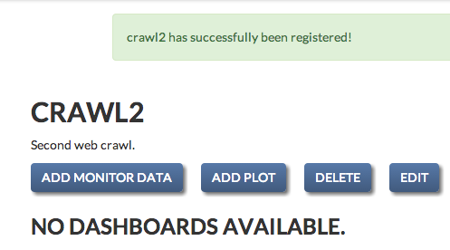
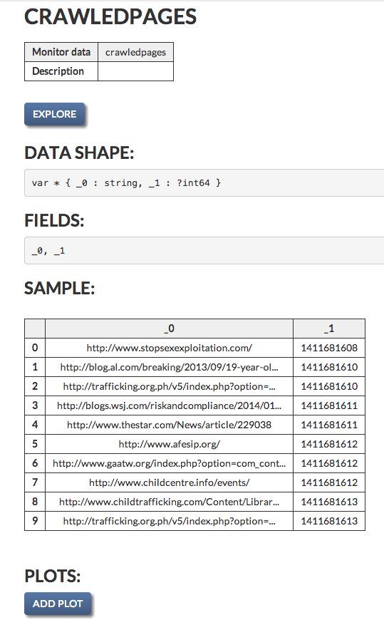
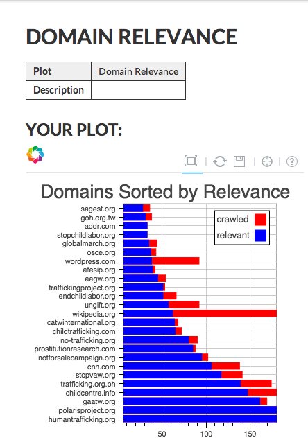

User's Guide to memex-viewer
----------------------------

*NOTE: memex-viewer is still in development, and features are still being added. Do not expect the current product to reflect the final one.*

The Interface
=============

This is the memex-viewer interface. It is designed to be clean, straightforward, and easy-to-use. 

.. image:: _static/img/homepage-view.png

Registering a Crawl
===================

To register a crawl, simply click the '+' button on the sidebar. This will take you to the crawl registration page, where you will provide the name and description for the crawl that you are regestering.

.. image:: _static/img/add-crawl.png

Assuming you have named your crawl 'crawl2', it will now show up on the sidebar, and you can begin to add plots and data sources for your crawl by clicking the link in the sidebar. 

.. image:: _static/img/sidebar-crawl2.png

Registering Monitor Data
========================

The next step in using memex-viewer is to register a data source for analysis. This data source must be a URI, or `Uniform Resource Identifier <http://en.wikipedia.org/wiki/Uniform_resource_identifier>`_. This tells memex-viewer where to look for your dataset, and it will register the location in a database for continued use. First, you should see the following menu when you have registered your crawl:

Next, click the 'Add Monitor Data' button to add a data source to your crawl. The menu looks similar to the add crawl menu, but with the added 'Data URI' field. At the moment, the data URI must be a link to somewhere on your computer. You can provide an absolute path (if it is not in the memex-viewer folder) or a relative path (if it is in the memex-viewer folder).

.. image:: _static/img/register-monitor-data.png

Exploring Registered Data
=========================

After going to the page of your new crawl, you should see a few menu items. There is the crawl data information, along with buttons for adding more data, adding plots, as well as deleting or editing the crawl page. 

.. image:: _static/img/crawl_dash.png

To explore the data, simply click on the link to the data, and then click 'Explore'. This will tell you about the shape of the data, as well as the first few items of the dataset. 

Plotting Registered Data
========================

In the future, you will be able to automatically generate plots for your data using ContinuumIO's plotting library, `Bokeh <http://bokeh.pydata.org/>`_. As of now, we have a sample of some datasets of web crawls that have been graphed and integrated into memex-viewer. This interface will look something like this:

and is accessable by clicking the relevant plot link on the crawl1 page.

Further Features
================

In addition to automatic plotting, in the future we will be adding capabilities for custom dashboards containing streaming data and animated graphs. 
