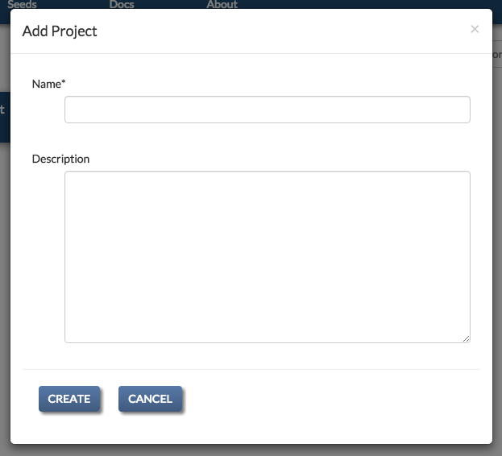
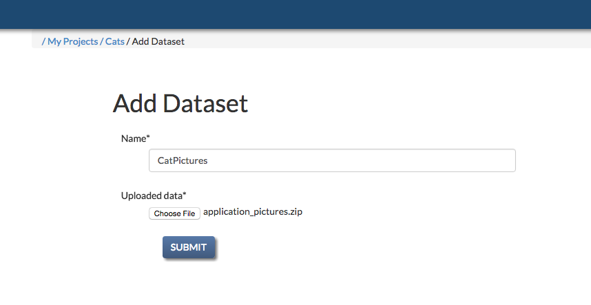
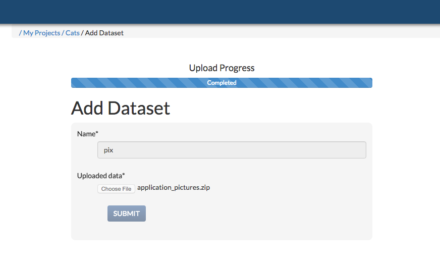
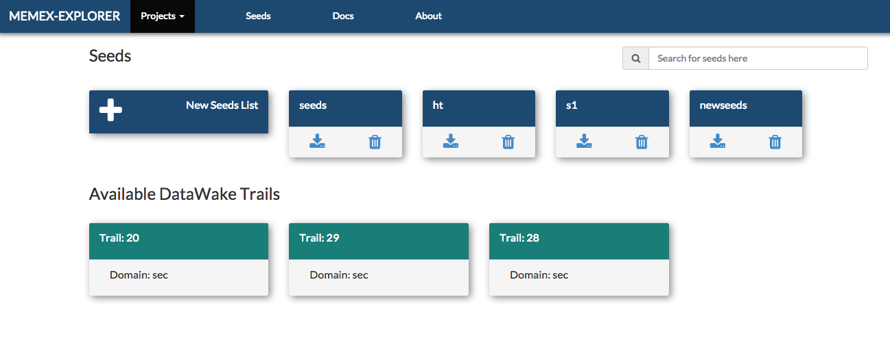
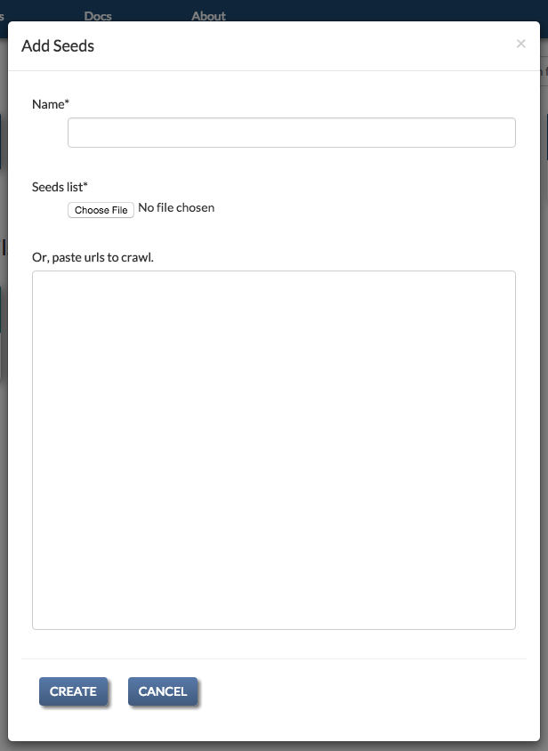
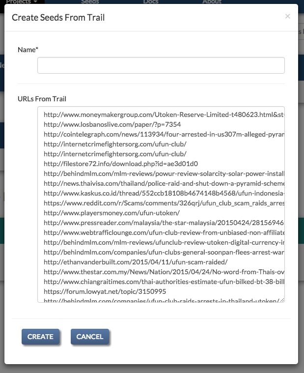

User's Guide to Memex Explorer
------------------------------

*NOTE: Memex Explorer is still under active development, and this guide is
constantly evolving as a result. For documentation requests, please*
`file an issue <https://github.com/memex-explorer/memex-explorer/issues>`_
*and we will endeavor to address it as soon as possible.*

Application Structure
=====================

The goal of Memex explorer is the bring together the functionalities of several applications in a seamless way, in order to assist the user in searching the deep web for domain specific information. Memex Explorer has integration with several applications, providing a front-end to various crawlers and domain search tools.

Web Crawling
  A service to create, run, and analyze `Nutch <http://nutch.apache.org/>`_ and `ACHE <https://github.com/ViDA-NYU/ache>`_ crawls. The crawl operation is heavily abstracted and simplified. Users provide a list of seed URLs to start the crawl, and in the case of ACHE's targeted crawling, a machine learning `model <https://github.com/ViDA-NYU/ache#build-a-model-for-aches-page-classifier>`_ to declare the relevancy of crawled pages.

Domain Discovery Tool
  Through the use of `Domain Discovery Tool <https://github.com/ViDA-NYU/domain_discovery_tool>`_, the user can search for content in the web and build data models based on clustering algorithms. The user can search the web and highlight relevant and irrelevant pages, and DDT will produce data model files, which you can use with Ache crawls in Memex Explorer.

DataWake
   `DataWake <https://github.com/Sotera/Datawake>`_ is a server and firefox plugin that tracks your search investigations. It keeps track of where you search, so that "trails" can be built out of the information that you gather. These trails can be converted to seeds lists in Memex Explorer, and can be used in both...

Home Page
=========

The landing page lists the currently registered projects. All the capabilities of Memex Explorer live under this project abstraction.

.. image:: _static/img/homepage-view.png

Creating a project just requires adding a name and an optional description.

Project Page
============

The project page lists the currently available services in Memex Explorer. These services can all be access from the project page.

.. image:: _static/img/project-page.png

Registering a Crawl
*******************

To register a new crawl, click the "Add Crawl" button above the Crawls table. This will open a popup for adding crawls. If necessary, you can also create seeds list objects and crawl models from the same form.

.. image:: _static/img/add-crawl.png

For Nutch crawls, you will need to provide a name, a description, and a seeds list text file containing newline-delimited URLs.

For ACHE crawls, you will need to provide the same inputs as above, and further select a Crawl Model.

Registering a Crawl Model
*************************

ACHE crawls require a *Crawl Model* to power the page classifier. The model consists of two elements: a "model" file and "features" file. These can be generated by following the `instructions <https://github.com/ViDA-NYU/ache#build-a-model-for-aches-page-classifier>`_ on the ACHE GitHub page.

To register a new crawl model, click on the "Add Crawl Model button" in the Crawl Models header. This will bring up the crawl model creation popup. Models can also be added from the add crawl form by selecting "ache" as a crawler.

.. image:: _static/img/add-crawl-model.png

Uploading Files and Index Creation
**********************************

With Memex Explorer you can create indices by uploading zipfiles of important documents. Memex Explorer will analyze these documents with `Tika <https://tika.apache.org/>`_. You can then easily access the documents from the local Elasticsearch Index, and incorporate them into other data analysis tools. You can create the dataset by clicking "Add Dataset" on the project page. 

The add dataset page has a progress bar, and  when your dataset has been successfully uploaded, you will get a success message and an alert to close the page. If you attempt to close the page before the files have been successfully uploaded, you will get an alert warning you to wait until the page is done uploading.

Seeds List Page
===============

Seeds for crawls are independent of projects. They are created by clicking on the "Seeds" button on the navbar. From the seeds list page you can create seeds list from files, or from datawake trails. You can also edit the seeds on a separate page. This is the seeds list page:

Registering a Seeds List
************************

Each crawl requires a seeds list object. Ache requires the seed list in a textfile, whereas Nutch requires a seeds list injection. The seeds list object handles both of these requirements. It creates a file for Ache and contains fields for injecting seeds through the Nutch REST Api. All seeds objects can be added on the "Add Crawl" popup. This is the seeds list form.

Seeds require a valid name, and either a file or urls placed in the textarea below. If any of your seeds are invalid, you will get a form error, and all the invalid urls will be highlighted. 

Creating a Seeds List from a DataWake Trail
*******************************************

If you are using DataWake, and Memex Explorer has access to the index used by DataWake, you will be able to create seeds lists from DataWake trails. To create a seeds list, all that is required is a valid name. After you create the seeds list, you can edit it just like any other seeds list.

