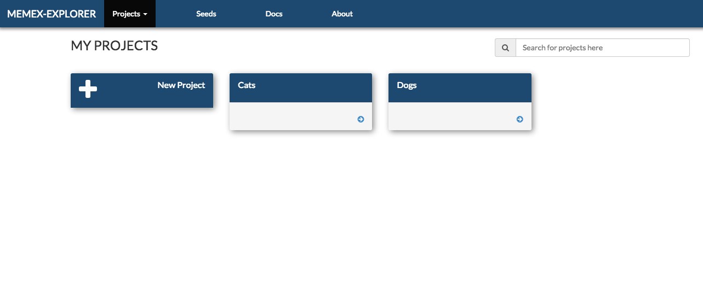
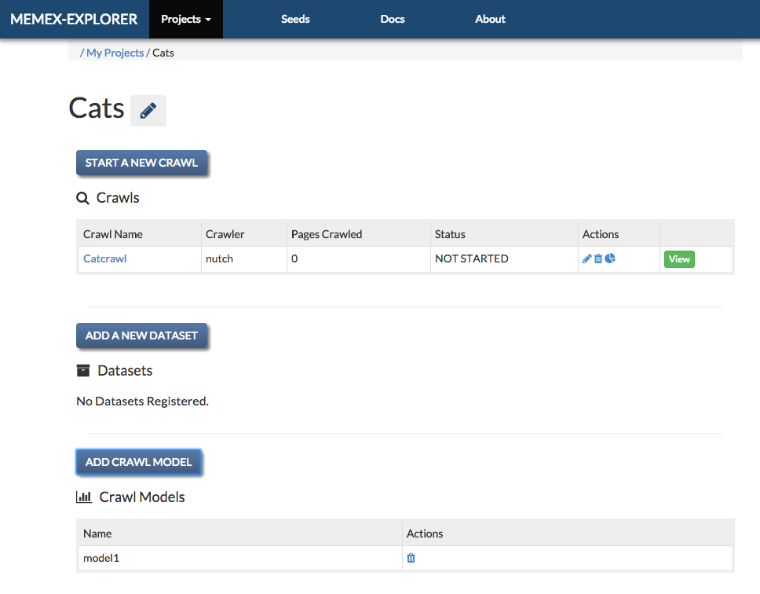
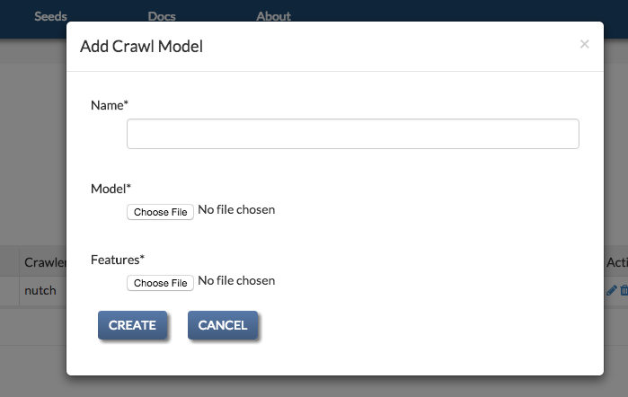
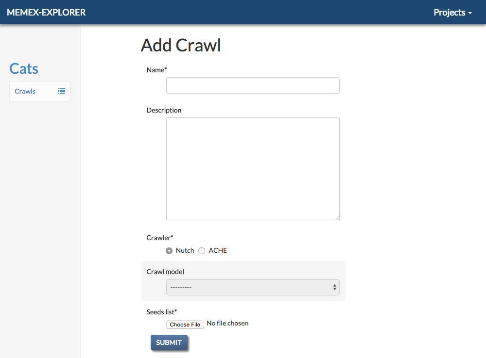

User's Guide to Memex Explorer
------------------------------

*NOTE: Memex Explorer is still under active development, and this guide is
constantly evolving as a result. For documentation requests, please*
`file an issue <https://github.com/memex-explorer/memex-explorer/issues>`_
*and we will endeavor to address it as soon as possible.*

Application Structure
=====================

The goal of Memex explorer is the bring together the functionalities of several applications in a seamless way, in order to assist the user in searching the deep web for domain specific information. Memex Explorer has integration with several applications, providing a front-end to various crawlers and domain search tools.

Web Crawling
  A service to create, run, and analyze `Nutch <http://nutch.apache.org/>`_ and `ACHE <https://github.com/ViDA-NYU/ache>`_ crawls. The crawl operation is heavily abstracted and simplified. Users provide a list of seed URLs to start the crawl, and in the case of ACHE's targeted crawling, a machine learning `model <https://github.com/ViDA-NYU/ache#build-a-model-for-aches-page-classifier>`_ to declare the relevancy of crawled pages.

Domain Discovery Tool
  Through the use of `Domain Discovery Tool <https://github.com/ViDA-NYU/domain_discovery_tool>`_, the user can search for content in the web and build data models based on clustering algorithms. The user can search the web and highlight relevant and irrelevant pages, and DDT will produce data model files, which you can use with Ache crawls in Memex Explorer.

DataWake
   `DataWake <https://github.com/Sotera/Datawake>`_ is a server and firefox plugin that tracks your search investigations. It keeps track of where you search, so that "trails" can be built out of the information that you gather. These trails can be converted to seeds lists in Memex Explorer, and can be used in both...

Home Page
=========

The landing page lists currently registered projects. All microservice features
are connected to, and accessed through, a given project. To create a project,
click on the "New Project" button.

Project Page
============

The project page lists actions provided by registered microservices. Click
on the gear icon to change the project name or description.

In the current Memex Explorer, only the Crawl Space microservice
has been registered. Therefore, each project page will list the current
crawls and crawl models.

Registering a Crawl Model
=========================

ACHE crawls require a *Crawl Model* to power the page classifier.
The model consists of two elements: a "model" file and "features" file. These
can be generated by following the `instructions <https://github.com/ViDA-NYU/ache#build-a-model-for-aches-page-classifier>`_ on the ACHE GitHub page.

To register a new crawl model, click on the '+' icon in the Crawl Models header.
This will take you to the crawl model registration page.

Registering a Crawl
===================

To register a new crawl, click the '+' icon in the Crawls header. This will
take you to the crawl registration page.

For Nutch crawls, you will need to provide a name, a description, and a seeds
list text file containing newline-delimited URLs.

For ACHE crawls, you will need to provide the same inputs as above, and
further select a Crawl Model.
